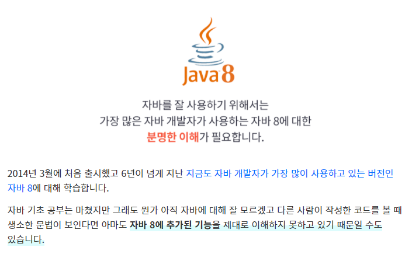

# 더 자바, Java 8

</img>

- 함수형 인터페이스와 람다 그리고 메소드 래퍼런스
- 인터페이스의 기본 메소드와 스태틱 메소드
- Stream과 Optional

해당 repo는 [더 자바, Java 8 - 백기선](https://www.inflearn.com/course/the-java-java8) 해당 강의를 듣고 정리한 REPO 입니다.
